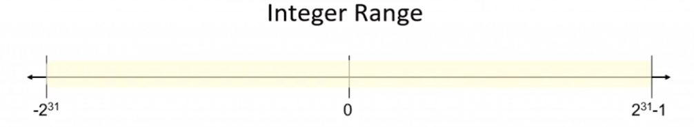
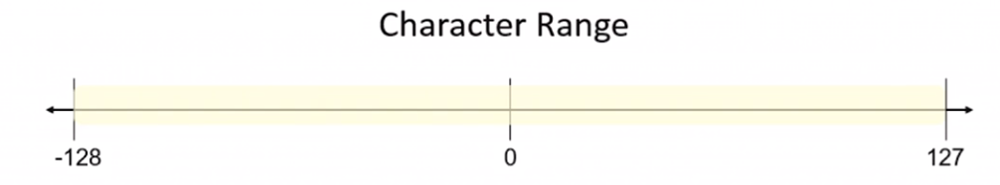

- tags: #cs50
- # int
	- Stores integers - numbers
	- they take 4 bytes of memory
	- the range is -ve and +ve two billion
		- 
- # Unsigned
	- it is a qualifier, doubles the range of +ve numbers with no -ve numbers
- # Char
	- takes in 1 byte
	- 
	- A = 65 in ASCII, a = 97
- # float
	- can be used for 4 bytes, or 32 bits of decimal numbers
- # double
	- 8 bytes of decimal!
- # void
	- it is a type, but not a data type
	- if used with a function, the function doesn't return anything