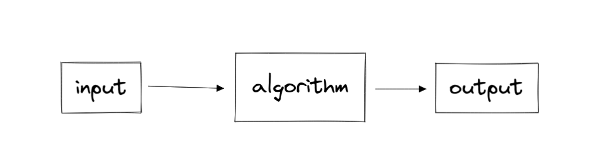

- tags: #cs50
- ## Week 0 - [link](https://youtu.be/YoXxevp1WRQ)
	- problem solving than programming
	- What is Computer Science?
		- input -> process -> output
	- representation of digits - binary
		- depends on the number of bits we have - more the bits, more then number
		- each column is a exponent of 10 (ten) - how humans represent numbers
	- ### representation of alphabets
		- each alphabet is associated with a number - decimal 65 - binary 01000001
		- ASCII numbers
		- has a representation for symbols as well
	- ### Representing Colours
		- RGB is the color combo we came up with
			- each bit has some amount of red, green, blue
			- hightest value is 255
			- pixelation of images -> has rgb on each pixel
	- ### Video files
		- keep changing the color of the pixels
		- change images each second
		- File extensions
			- the community agreeing to similar patterns of 1s and 0s across each file
	- ### Algorithm
		- Bug : mistake in the program/algorithm
		- Phone book - number searching example where sir tears pages
	- ### Pseudocode
		- the code explained in simple english
	- ### Functions
		- A piece of code dedicated to solve/work on something small as comapred to the big program
	- Boolean expression
		- has a 1/0, true/false, yes/no answer
	- Loops
		- running the same code again and again for will it matches some expression
	- 