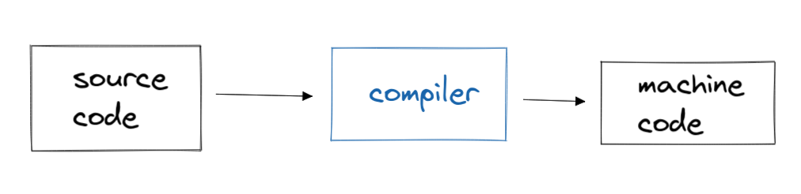

- Terminal - to run code
- code editor - write code
- 
- `make hello` is compiling the c code and the output being a executable file called "hello".
- ```c
  printf("Hello, World!");
  # printf is the function
  # 'Hello, World!' is the arguement or parameters
  # has to end with a semicolon just like a full stop in english sentences 
  ```
- Functions can return variables (results)
- `=` is the assignment operator, value of right goes to the left
- use variables which should be understandable within the context of the code.
- `\n` is newline.
- header files - give access to more functions than the standard library (eg, stdio.h, cs50.h)
- `mkdir` - create a folder
- `mv <name>` - move a file (can help in renaming)
- `cd <name>` - change directory
- `..` is previous directory
- `rmdir <name>` - delete the directory
- Check [LinuxJourney](https://linuxjourney.com/) to learn more about how to navigate around the Linux CLI
- typecasting - converting one datatype to another
	- ```c
	  int x,y;
	  float z = (float) x / (float) y # typecasting done above
	  ```
- `==` is for equality
- `counter++` == `counter += 1` == `counter = counter + 1`
- ```c
  for(initialisation expression, test expression, updation expression)
  {
    code...
  }
  
  int i = 0
  while (i < 50)  // prints hi fifty times in new line
  {
    printf("hi!\n");
  }
  ```
- `||` OR
- `&&` AND
- Scope of a variable: life of a variable lies between the two parenthesis.
- The famous Y2K problem: years were stored as digits of two. After 2000s, it broke since 98 could be the same as 1998 or 2098.